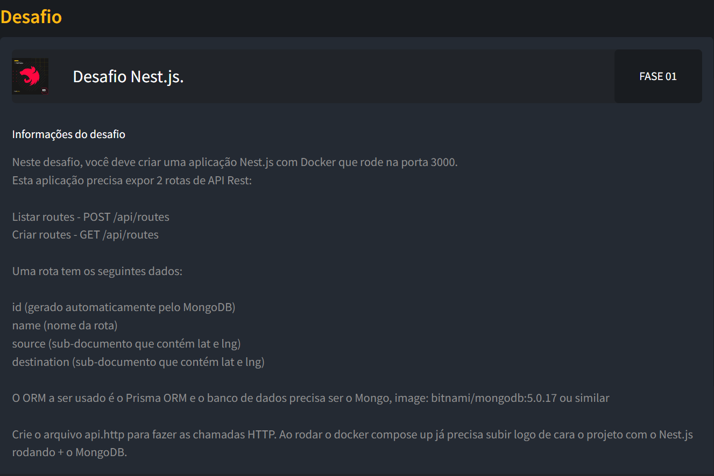
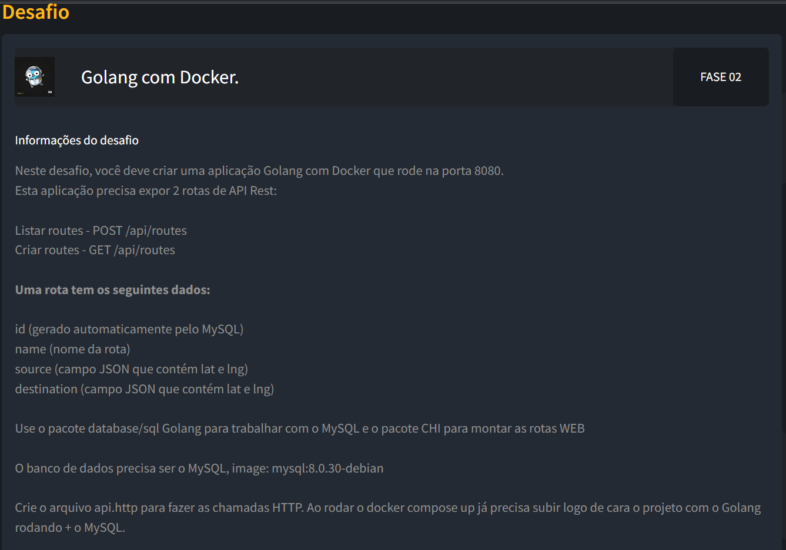

# Imersão Full Cycle 14

Assuntos e tecnologias abordadas: 

    Docker
    DevContainer
    Websockets
    Nestjs
    Nextjs
    Material UI
    React Server Components
    GoLang
    Kafka
    Prometheus
    Grafana
    Terraform
    Event-Driven Architecture
    O11y ou Observabilidade
    Padrões de Persistência

## Desafios

### Desafio Nodejs com Nest

Detalhes do desafio na imagem abaixo, e a solução em [desafio-nest](./desafio-nest/): 

### Desafio Go

Detalhes do desafio na imagem abaixo, e a solução em [desafio-go](./desafio-go/): 

